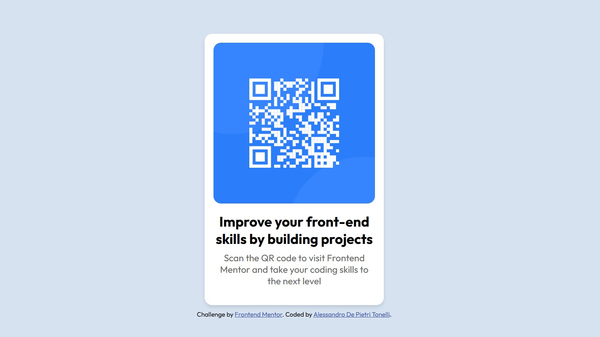

# Frontend Mentor - QR code component solution

This is a solution to the [QR code component challenge on Frontend Mentor](https://www.frontendmentor.io/challenges/qr-code-component-iux_sIO_H). Frontend Mentor challenges help you improve your coding skills by building realistic projects. 

## Table of contents

- [Overview](#overview)
  - [Screenshot](#screenshot)
  - [Links](#links)
- [My process](#my-process)
  - [Built with](#built-with)
  - [What I learned](#what-i-learned)
- [Author](#author)

## Overview

### Screenshot

### Links

- Solution URL: https://github.com/adptCode/QR-code-component.git
- Live Site URL: https://qr-code-fm-adpt.netlify.app/

## My process

### Built with

- Semantic HTML5 markup
- CSS custom properties
- Grid

### What I learned

1. Creating a Basic Card in CSS
    I can design a visually appealing card without using libraries like Bootstrap, just with HTML and CSS.
    
2. Using Media Queries for Responsiveness
    Media queries are essential for adapting layouts to different screen sizes (e.g., desktop vs. mobile).

3. Responsive Design Best Practices
    Use percentages (%) for width to create fluid layouts.
    Test designs on multiple screen sizes to ensure usability across devices.

4. Separation of Concerns
    By keeping your HTML and CSS separate, you maintain a clean and organized codebase that’s easier to read, maintain, and update.

## Author

- Website - [Alessandro De Pietri Tonelli](https://github.com/adptCode)
- Frontend Mentor - [@adptCode](https://www.frontendmentor.io/profile/adptCode)
- Twitter - [@AlessandroDPT](https://www.twitter.com/AlessandroDPT)
